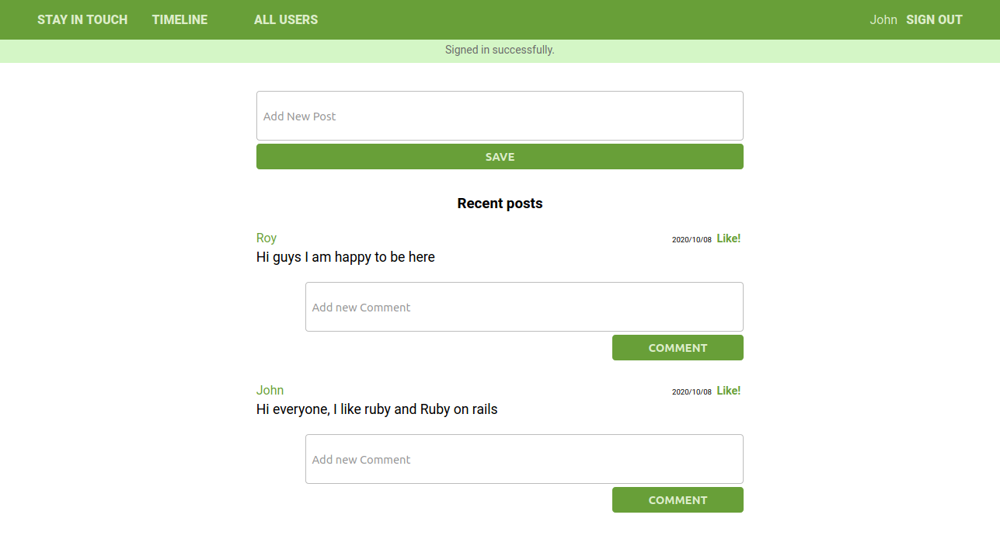

# Social Media App
 This is a scaffold for an online social media platform.

 Users can sign-in and sign-up, create posts, comments and like posts.
 
 Registered Users can send friend requests, accept or decline friend requests from other users, unfriend friends.
 
 In the `Timeline` users can only view friends' posts.

## screenshots!

## Built With

- Ruby v2.7.0
- Ruby on Rails v5.2.4.3

## Live Demo

- [Social Media App](https://still-citadel-61381.herokuapp.com)

## How to run this project on your local machine

### Prerequisites
1. You should have ruby installed.(This project was tested on version `2.7.0`)
1. You should have rails installed.(This project was tested on version `5.2.4.3`)
1. You should have bundler installed.(This project was tested with Bundler version `2.1.4`)

   
### Steps to follow
1. Clone the repository to your local machine using `git clone git@github.com:ershadul1/ror-social-scaffold.git`
1. On your local machine, navigate to the ror-social-scaffold folder using `cd ror-social-scaffold` in your terminal
1. Install all the gems for the project by running `bundle` in your terminal
1. Migrate the database using this command
`bin/rake db:migrate`
1. Start the server by using this command.
`bin/rails server`

1. Open this link in your favorite browser `http://localhost:3000`

## Authors

👤 **Roy Ntaate**

- Github: [@RNtaate](https://github.com/RNtaate)
- Twitter: [@RNtaate](https://twitter.com/RNtaate)
- Linkedin: [roy-ntaate](https://linkedin.com/in/roy-ntaate)

👤 **Ershadul Rayhan**

- Github: [@ershadul1](https://github.com/ershadul1)
- Twitter: [@ErshadulRayhan](https://twitter.com/ErshadulRayhan)
- Linkedin: [ErshadulRayhan](https://www.linkedin.com/in/ershadulrayhan)
- Email:  ershadul.rayhan@gmail.com

## Show your support

Give a ⭐️ if you like this project!

## Acknowledgments

- This project was inspired by the [Microverse](https:www.microverse.org) program using the following [github](https://github.com/microverseinc/ror-social-scaffold) repository
